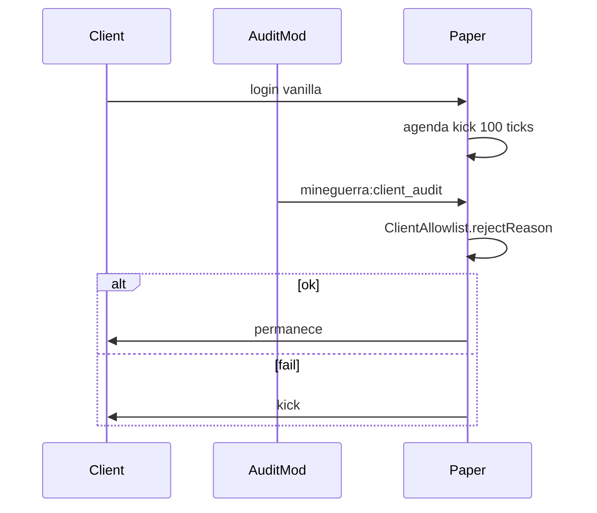

# Integração com o servidor Paper

Plugin: **[mineguerra_plugin_2026](https://github.com/lseixas/mineguerra_plugin_2026)**

| Item | Caminho |
|------|---------|
| Listener + timeout | `main/java/.../clientaudit/ClientAuditListener.java` |
| Codec (referência) | `ClientAuditCodec.java` |
| Allowlist | `main/resources/client-allowlist.yml` → `plugins/mineguerra_plugins/client-allowlist.yml` |
| Docs plugin | `docs/CLIENT_AUDIT.md` |

## Fluxo



## Config servidor (`enabled: false` hoje)

```yaml
enabled: false          # ligar só quando este mod existir
timeoutTicks: 100
bypassPermission: mineguerra.admin
mode: exact
expectedMcVersion: "1.21.8"
```

## Limitações

- O cliente **declara** mods/packs; cheat pode mentir. Objetivo: barra casual (mod extra, sem audit, pack xray).
- Não substitui anti-cheat de combate (Grim, etc.).

## Ativar no evento

1. Publicar JAR deste mod + lista de mods no Discord/wiki
2. Jogadores instalam o pack Fabric estrito
3. Servidor: `enabled: true` + `allowedPackSha1` quando o resource pack MineGuerra for obrigatório
4. Testar join staff (bypass) e jogador com allowlist exata

## Servidor de teste

- Docker: `mine-guerra-bukkit-2026`, porta **25567**
- Deploy plugin: `./gradlew jar` no repo do plugin (copia JAR via `gradle.local.properties`)
- Config ativa: `plugins/mineguerra_plugins/client-allowlist.yml` com **`enabled: true`**

## Testes manuais

**Ambiente validado em 2026-08-17** (commit `ac0513b` + fix rede `0.1.1`):

| Cenário | Resultado | Como validar |
|---------|-----------|--------------|
| Allowlist exata | OK (automático) | `ClientAuditAllowlistIntegrationTest.exactAllowlistAcceptsAfterCodecRoundTrip` |
| Sem `mineguerra-client-audit` | Kick timeout ~5s | Entrar sem o mod; mensagem `Instale o mod MineGuerra Audit.` |
| Mod extra (Jade) | Kick imediato | `ClientAuditAllowlistIntegrationTest.extraModJadeIsRejected` |
| Wire format cliente→plugin | OK | `ClientAuditAllowlistIntegrationTest.pluginCodecCanDecodeClientEncodedBytes` |

**Perfil Fabric** (allowlist exata): ver [ALLOWLIST.md](ALLOWLIST.md) — todos os mods listados + `mineguerra-client-audit`.

**Logs esperados:**
- Servidor: `Client audit ATIVO (exact, timeout 100 ticks).`
- Cliente (debug): `Handshake enviado: N mods, M packs, shader='...'`
- Se Paper não anunciar canal CustomPayload: warn `enviando handshake mesmo assim` (fix 0.1.1)

**Instalação do mod:** copiar JAR para `.minecraft/mods/` (ou perfil Prism) e conectar em `localhost:25567`.
